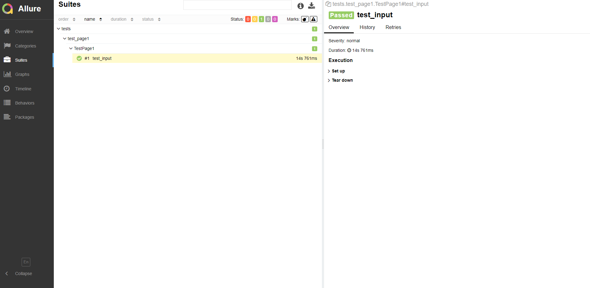

# Onliner test + Allure
## Steps
1. Clone the repository

```
https://github.com/vladimir-grigoriev/onliner_test_allure.git
```
2. Create and run virtualenv
```
python -m venv venv
. ./venv/bin/activate
```
3. Install all the requirements from requirements.txt
```
pip install -r requirements.txt
```
4. Make sure, that Chrome Webdriver folder exists in your PATH and Allure is installed
5. Run tests with the command
```
pytest -v -s --alluredir="path/to/reports/folder" tests/
```
6. Create Allure reports with next command
```
allure serve /path/to/reports/folder
```
___

## Screenshot for Pytest + Allure report
